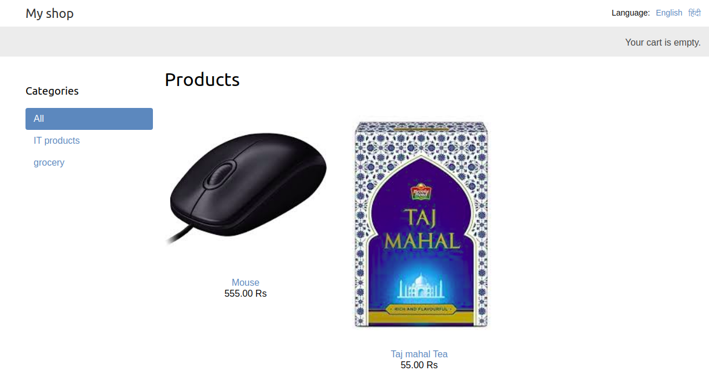
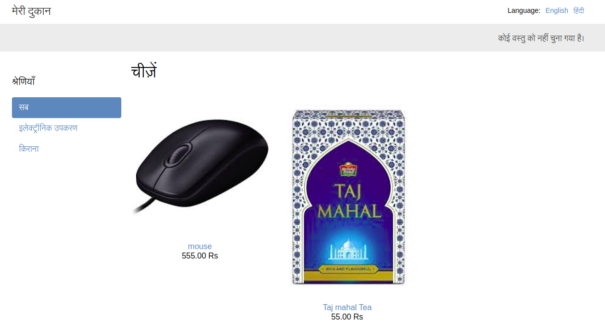
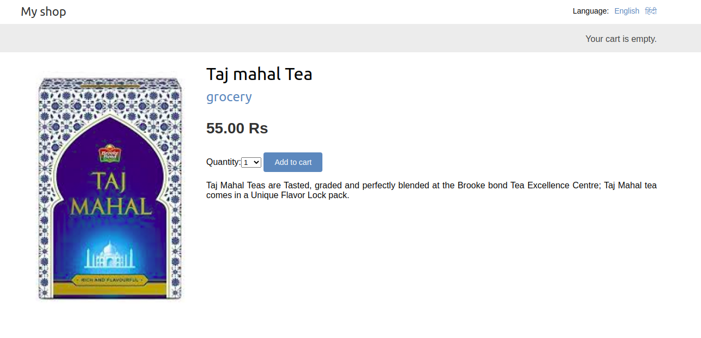
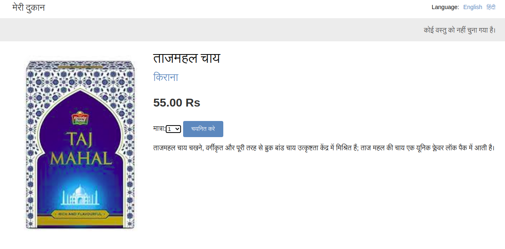
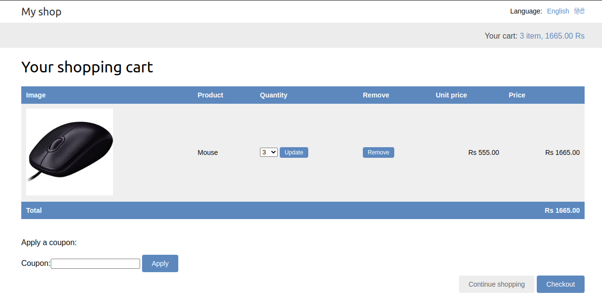
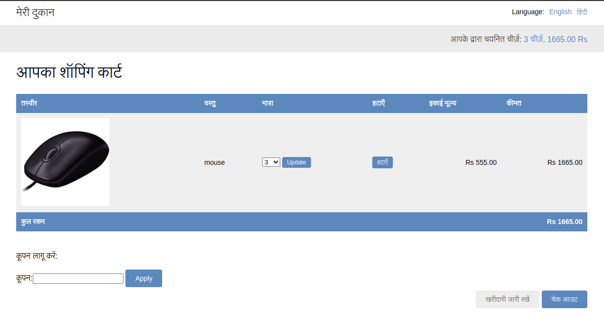
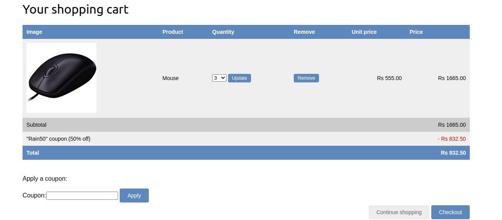
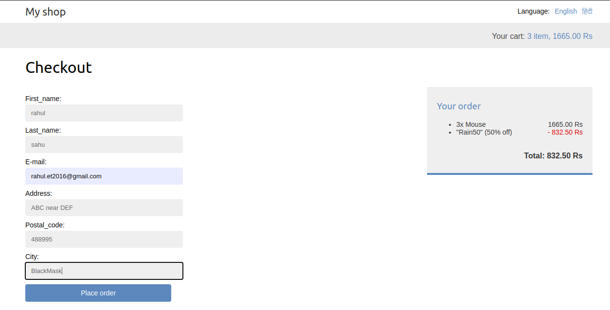

# MyShop

### MyShop is an online store.

### Technologies

* Python 3.7.
* Django >3.
* Celery for asycronus email.
* rosetta for UI translation.
* parler for model translation.
* WeasyPrint for PDF genration.
        
### this application is avaliable in two language English and hindi
### 
## Screenshot

### HomePage

#### in english

#### in Hindi

### Product Description

#### in english

#### in Hindi

### Cart

#### in english

#### in Hindi

### Coupon

### CheckOut

### Bill PDF

