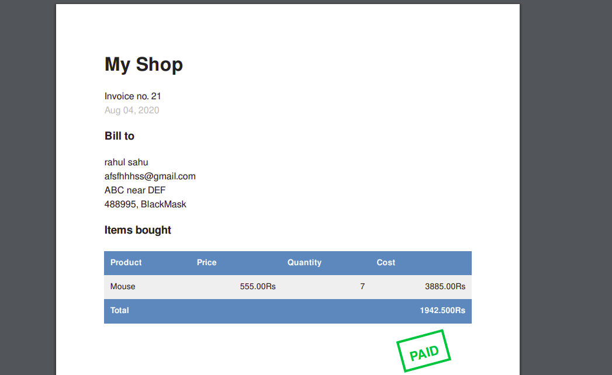

# MyShop

### MyShop is an online store.

### Technologies

* Python 3.7.
* Django >3.
* Celery for asycronus email.
* rosetta for UI translation.
* parler for model translation.
* WeasyPrint for PDF genration.
        
### this application is available in two language English and hindi
### Installation
* make virtual environment and activate virctual environment 
  ```bash
  $ python3 -m venv myshop_venv
  $ source myshop_venv/bin/activate
  ```
* clone respositry
  ```bash
  $(myshop_venv) git clone https://github.com/rahulsa123/MyShop.git
  $(myshop_venv) cd MyShop
  ```
* Install dependencies and run server
  ```bash
  $(myshop_venv) pip3 install -r requirements.txt
  $(myshop_venv) ./manage.py makemigrations
  $(myshop_venv) ./manage.py migrate
  $(myshop_venv) ./manage.py createsuperuser # for admin page
  $(myshop_venv) ./manage.py runserver
  ```

## Screenshot

### HomePage

#### in english


#### in Hindi


### Product Description

#### in english


#### in Hindi


### Cart

#### in english


#### in Hindi


### Coupon


### CheckOut


### Bill PDF



